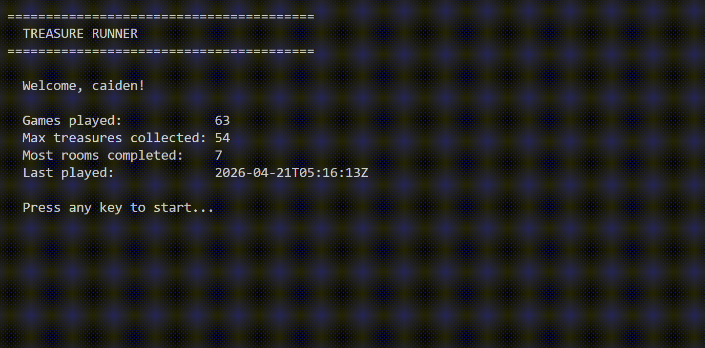

# Treasure Runner

A multi-language dungeon exploration game built in C and Python. The game engine is written in C and exposed to Python via `ctypes`. The terminal UI is built with the `curses` library following a strict MVC architecture.



---

## Tech Stack

| Layer | Technology |
|-------|-----------|
| Game Engine | C (compiled to shared library `libbackend.so`) |
| Python Bindings | `ctypes` |
| UI | Python `curses` |
| Serialization | Python `json` |
| C Testing | [Check](https://libcheck.github.io/check/) framework |
| Python Testing | `unittest` |
| Memory Safety | Valgrind |

---

## Architecture

```
GameUI  (curses — view layer)
    │
    ▼
GameEngine  (ctypes — controller layer)
    │
    ▼
libbackend.so  (C — game engine)
    │
    ├── Graph          room connectivity
    ├── Room           layout, portals, treasures, pushables, switches
    ├── Player         position, collected treasure tracking
    └── WorldLoader    datagen → Room structs
```

The C side owns all game state. The Python side only owns the player profile dict, visited-rooms set, victory flag, and current message string — nothing duplicates C-side data.

---

## Project Structure

```
.
├── c/
│   ├── include/        C header files
│   └── src/            C source files
└── python/
    ├── run_game.py     Entry point
    └── treasure_runner/
        ├── bindings/
        │   └── bindings.py     ctypes bindings to C library
        ├── models/
        │   ├── exceptions.py   C status code → Python exception mapping
        │   ├── game_engine.py  Controller
        │   └── player.py       Player model
        └── ui/
            └── game_ui.py      Curses UI
```

---

## Features

### Core
- Dungeon exploration across multiple connected rooms
- Treasure collection, pushable block puzzles, portal traversal
- Player profile persistence via JSON — tracks games played, max treasures, rooms visited, last played timestamp
- Full curses terminal UI with message bar, legend, minimap, status bar, splash and quit screens
- Game reset and terminal size validation

### Extended
- **Collect All the Treasure** — game ends in victory when every treasure in the world is collected. Live progress shown in message bar (e.g. `12/20`). Victory screen shows elapsed time and final stats.
- **Locked Doors (Switches)** — gated portals cannot be traversed until their linked pressure switch is activated by pushing a block onto it. Real-time visual feedback distinguishes locked portals (red) from open ones (green).

---

## Controls

| Key | Action |
|-----|--------|
| `W` / `↑` | Move north |
| `S` / `↓` | Move south |
| `A` / `←` | Move west |
| `D` / `→` | Move east |
| `>` | Enter portal (must be standing on it) |
| `r` | Reset to initial world state |
| `q` | Quit |

---

## Game Elements

| Symbol | Colour | Meaning |
|--------|--------|---------|
| `@` | Cyan | Player |
| `#` | White | Wall |
| `$` | Yellow | Treasure |
| `X` | Green | Portal — open |
| `X` | Red | Portal — locked |
| `O` | Magenta | Pushable block |
| `=` | Magenta (dim) | Pressure switch (unpressed) |
| `+` | Green | Pressure switch (pressed) |

---

---


## Author

Caiden Kowalchuk — ckowal02@uoguelph.ca